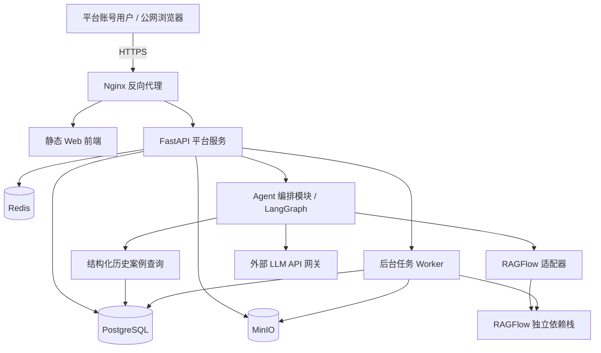

# 新能源装载机设备智能运维平台：Stage 4 平台级架构设计

- 版本：候选版 v2.0
- 状态：方案已确认，等待书面架构基线评审
- 依据：Stage 1 需求基线、Stage 2 交互基线、Stage 3 原型基线，以及 2026-07-14 项目负责人的架构确认
- 取代范围：`维修故障诊断Agent架构设计.md` 不再作为 Stage 4 的系统级架构基线；其内容仅保留为“维修接单前诊断”子模块输入。

## 1. 架构目标与原则

本架构覆盖整个智能运维平台，而非单一维修故障诊断 Agent。平台必须支持账号登录、组织与设备管理、故障—工单—维修闭环、统一健康分与固定指标、工作台与驾驶舱 BI、智能配置、五类 Agent、知识库、通知、审计、附件、测试与单机运维。

1. **业务事实唯一来源**：PostgreSQL 与业务 API 是设备、故障、工单、维修、健康分、指标、配置、通知和审计的唯一事实来源。
2. **AI 不直接写事实**：模型只基于受控工具结果生成语言、建议与草稿；正式业务写入必须通过业务 API 和人工确认。
3. **结构化与非结构化分流**：历史维修案例由 PostgreSQL 查询；手册、规范、复盘等文档由本地 RAGFlow 检索。
4. **模块化单体优先**：单台 Windows 主机不拆分大量微服务；在 FastAPI 内以清晰领域模块、端口和异步任务边界实现，保留未来拆分条件。
5. **可解释、可降级、可追溯**：引用、模型调用、工具调用、确认与业务写入均审计；AI/RAGFlow/模型不可用时保留人工业务流程。

## 2. 选型结论

| 范畴 | 选型 | 理由 |
|---|---|---|
| 业务关系型数据库 | PostgreSQL | 适合工单事务、审计关联、健康分/BI 聚合、JSONB Agent 运行状态、LangGraph checkpoint 与后续扩展。 |
| 业务后端 | Python 3.13 + FastAPI | 与现有 AI/RAGFlow/LangGraph 技术基线一致，适合异步 API 和 SSE。 |
| 缓存与任务协调 | Redis | 用于缓存、限流、任务队列和 SSE 协调，不保存业务事实。 |
| 对象存储 | MinIO（S3 兼容） | 保存图片、日志、视频和知识文件的二进制内容。 |
| 知识检索 | 本地部署 RAGFlow + Elasticsearch 8.11 | Elasticsearch 同时承担向量、全文与混合检索；RAGFlow 负责解析、切片、重排和引用。 |
| AI 编排 | LangGraph（平台服务内模块） | 负责多轮状态、工具白名单、人工中断恢复与流式事件。 |
| LLM | 外部 OpenAI 兼容 API | 通过受控网关调用；聊天、Embedding、Rerank 独立配置。 |
| 运行环境 | 单台 Windows + Docker Desktop/WSL2 | 当前部署约束；全部运行时依赖使用 Linux 容器。 |

不采用 MySQL 作为**平台业务库**：本期需要的 JSONB 查询、复杂聚合、窗口分析、审计关联和 LangGraph checkpoint 与 PostgreSQL 的契合度更高。RAGFlow 自身仍使用其独立 MySQL 元数据组件。向量检索不采用 pgvector：RAGFlow 当前文档引擎选用 Elasticsearch 8.11，以获得向量、BM25 全文和混合检索。也不采用微服务优先方案：在单机环境中会增加发布、日志、网络和事务协调成本，收益不足。

## 3. 系统上下文与容器拓扑



容器网络分为 `edge`、`app`、`ragflow` 三层。仅 Nginx 的 HTTPS 端口对公网暴露；PostgreSQL、Redis、MinIO、RAGFlow、Elasticsearch 和 Worker 不提供公网端口。RAGFlow 使用独立的 MySQL、Redis、MinIO 和 Elasticsearch 8.11 实例或账号，不与业务 PostgreSQL、Redis、MinIO 共享依赖账户。

## 4. 平台领域模块

| 模块 | 职责 | 核心数据 | 依赖边界 |
|---|---|---|---|
| 身份与权限 | 账号、会话、角色、菜单、操作权限、登录审计 | User、Role、Permission、Session、LoginEvent | 不承载设备/工厂行级隔离。 |
| 组织与设备 | 工厂树、车间、产线、设备、BOM、参数、负责人 | Organization、Equipment、EquipmentBom、EquipmentParameter | 组织用于管理、筛选、统计与审计。 |
| 附件与知识 | 上传、扫描、对象存储、知识库元数据、RAGFlow 生命周期 | FileObject、KnowledgeDataset、KnowledgeDocument、Citation | 向量、切片由 RAGFlow 保存。 |
| 故障与维修 | 故障上报、接单、工单、维修、验收、案例沉淀 | FaultReport、WorkOrder、MaintenanceRecord、HistoricalRepairCase | 维护状态机与业务事务。 |
| 健康与指标 | 统一健康分、快照、40 项固定指标、BI 聚合 | HealthScoreSnapshot、MetricDefinition、MetricQueryResult | 指标目录只读，禁止模型生成数值。 |
| 智能配置与治理 | 模型、Agent、知识库绑定、提示词版本、调用记录、Token | ModelProvider、ModelBinding、AgentConfig、PromptVersion、AgentUsage | 密钥仅存安全配置，不入审计明文。 |
| Agent 编排 | 五类 Agent、线程、SSE、工具、确认、摘要 | AgentThread、AgentRun、ToolCall、AgentConfirmation | 只能调用白名单业务工具。 |
| 通知与审计 | 业务通知、已读状态、操作审计、安全审计、幂等 | Notification、NotificationRead、AuditEvent、IdempotencyKey | 审计不能反向修改业务事实。 |
| 异步任务 | 文档同步、健康重算、通知、案例沉淀、备份 | JobRun、RetryRecord | 不在业务事务内执行模型或外部调用。 |

## 5. 数据关系与业务状态

```text
Organization -> Equipment -> FaultReport -> WorkOrder -> MaintenanceRecord
MaintenanceRecord -> HistoricalRepairCase
Equipment -> HealthScoreSnapshot
KnowledgeDataset -> KnowledgeDocument -> KnowledgeCitation
AgentConfig -> AgentThread -> AgentRun -> ToolCall / Citation / Confirmation
```

状态机：

- 故障：`AI_DRAFT -> PENDING_ACCEPT -> IN_REPAIR -> PROCESSED`。
- 工单：`DRAFT -> PENDING_ACCEPT -> IN_REPAIR -> PENDING_INSPECTION -> COMPLETED`。
- 知识文档：`UPLOADING -> SCANNING -> PARSING -> READY`，或进入 `FAILED`；只有 `READY` 可检索。
- 预诊断：`QUEUED -> READY -> OPEN_LOADING -> QUESTIONING -> EVIDENCE_PENDING -> DIAGNOSIS_READY -> ADOPTED | DIRECT_START | UNAVAILABLE`。

结束维修后，维修人员最终提交的故障类型、故障原因、处理措施、备件更换说明和维修结果才是业务事实。若采纳过 AI 建议，则保留只读“AI 诊断对话摘要”，摘要包含故障现象、关键证据、结论与建议，但不保存原始思维过程。

## 6. Agent、RAGFlow 与 LLM 调用边界

平台包含全局 Agent、AI 故障上报 Agent、智能问数 Agent、操作指引 Agent、故障诊断 Agent。所有 Agent 均从智能配置读取启用状态、模型绑定、流式开关、问题建议、引用展示、知识库绑定、超时和限流配置。

维修接单前诊断流程：创建故障单后异步生成预诊断草稿；打开开始维修页后展示约 3 秒的检索与分析过程；随后以 SSE 输出动态追问。Agent 先查询 PostgreSQL 的同类设备相似故障历史案例，再调用 RAGFlow 获取文档依据，最后将受控结果发送至外部 LLM。

“有报警码”会进入具体报码或截图收集状态，而非跳过问题。否定信息、未测量或无报警码只属于缺失/排除证据。仅在“复现工况 + 至少两类有效技术证据”满足后，才能生成根因分析、检查清单、推荐维修方案、备件/安全建议并显示采纳动作。直接开始维修会清除临时诊断状态，不预填结束维修页面，也不显示 AI 摘要。

Agent 工具白名单至少包括：读取当前用户与权限、读取设备与组织、查询故障/工单/维修历史、查询健康分、查询固定指标、检索知识库、创建受确认保护的故障/工单草稿、提交已确认的业务请求。禁止直接 SQL、任意文件系统执行、用户/权限变更、健康分写入和绕过确认的维修事实写入。

## 7. 权限、信任与安全边界

本期取消工厂/设备授权隔离机制：不设置 `EquipmentGrant`，不按设备或工厂对业务数据、历史案例、BI 或 Agent 工具结果进行行级过滤。仍必须执行服务端的账号认证、角色、菜单和操作权限校验。

浏览器输入、上传文件、外部 LLM、RAGFlow 返回、Agent 工具请求均属于不可信边界。业务 API 必须验证输入和权限，所有可重复写操作使用幂等键。附件限制 100 MB，先进行类型、大小和病毒扫描；二进制保存至 MinIO，关系、状态和下载审计保存至 PostgreSQL。

审计记录操作者、目标、动作、结果、线程、工具、引用、模型、耗时和错误码；不得记录密码、Cookie、令牌、模型密钥或敏感附件原文。Agent 线程仅允许创建者或系统管理员读取与恢复。

## 8. 单机运维、降级与恢复

Windows 主机运行 Docker Desktop/WSL2。Nginx 终止 HTTPS；业务服务、数据库、缓存、对象存储、Worker 和 RAGFlow 运行于内部 Docker 网络。外部模型 API、RAGFlow 或 Agent 配置不可用时，平台必须解释不可用原因并保留人工上报、人工接单和人工结束维修。

每日 00:10 对业务 PostgreSQL、MinIO 文件与元数据、关键配置执行备份，保留 10 天；备份必须复制到主机外的网络存储或外接存储，不能只放在同一磁盘。健康检查覆盖 FastAPI、PostgreSQL、Redis、MinIO、RAGFlow 和外部模型连通性。单机架构不承诺高可用；主机故障时通过备份恢复。

## 9. Stage 5 前验证门槛

1. 单元/API：设备、故障、工单、维修、健康分、权限、幂等、状态迁移。
2. 集成：PostgreSQL 历史案例、RAGFlow 文档生命周期与引用、外部 LLM 网关、SSE、Agent 中断恢复。
3. 安全：未登录、无操作权限、密钥脱敏、附件访问、限流与审计完整性。
4. 端到端：登录 -> 故障 -> 诊断采纳或直接开始 -> 维修 -> 结束维修 -> 案例沉淀与健康分快照。
5. 运维：容器重启后线程恢复、RAGFlow 降级、外部模型超时、备份恢复演练。

## 10. 风险与后续边界

| 风险 | 处理 |
|---|---|
| 单机故障 | 明确不做高可用；以外部备份和恢复演练控制风险。 |
| 外部模型不稳定/成本波动 | 超时、限流、熔断、Token 统计、人工降级。 |
| RAGFlow 与业务事实混淆 | Elasticsearch/RAGFlow 仅作向量、全文、混合检索与引用证据；业务事实仅来自 PostgreSQL/API。 |
| Agent 越权或幻觉写入 | 工具白名单、服务端验证、人工确认、全程审计。 |
| 现有原型仍含授权设备文案 | Stage 4 计划中安排对应原型、需求、交互和测试基线一致性修订。 |

本文件获书面评审确认后，才可据此更新系统架构、ADR、数据模型、API 规格、测试契约和详细实施计划，并申请 Stage 4 门禁批准。
