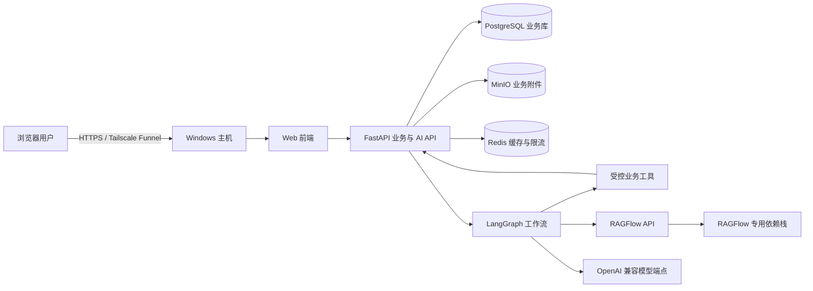

# AI 技术 SPEC：RAGFlow 与 LangGraph（一期）

状态：开发基线  
日期：2026-07-13  
适用范围：新能源装载机设备智能运维平台一期

## 1. 技术结论

一期必须采用 RAGFlow 作为知识库工具、LangGraph 作为智能体工作流框架。二者不是两个平行的业务系统：业务后端是唯一业务事实源和写入入口；RAGFlow 仅处理知识文档，LangGraph 仅编排受控的推理、工具调用与人工确认。

后端采用 Python 3.13 + FastAPI。选择理由是 LangGraph 原生 Python 生态、业务服务与工作流在同一运行时，且适合本项目 10 人以内并发、100 台以内设备的演示环境。数据库采用 PostgreSQL；附件使用 MinIO/S3 兼容对象存储；Redis 用于短期缓存与限流。RAGFlow 使用其独立 Docker Compose 依赖栈，不能与业务 PostgreSQL、Redis 或 MinIO 共享实例和账号。

模型调用通过 OpenAI 兼容模型网关配置，不在代码中绑定特定厂商或本地模型。部署时只需提供聊天模型、Embedding 模型、Rerank 模型各自的名称、地址和密钥；没有配置时，AI 功能启动失败并明确报错，绝不以伪结果兜底。

## 2. 边界与禁止项

| 组件 | 允许职责 | 明确禁止 |
|---|---|---|
| 业务后端 | 身份认证、菜单权限、设备/故障/维修业务、指标计算、健康分读取、审计、附件元数据 | 将静态原型数据视为业务数据 |
| RAGFlow | 文档解析、切片、检索、重排、返回引用片段 | 保存业务事实、计算指标、直接写入业务单据 |
| LangGraph | 意图识别、受控路由、调用白名单工具、多轮补齐、人工确认、结果总结 | 绕过业务 API 写数据、计算或猜测指标值、修改健康分 |
| LLM | 理解自然语言、组织回答、说明检索结果 | 自行虚构数值、故障结论、维修记录或引用来源 |

智能问数只能调用 40 项内置指标及允许维度。健康分、工作台、BI、设备台账、设备详情和智能问数均只能读取统一健康分服务结果。

## 3. 部署拓扑

Windows 主机安装 Docker Desktop 并启用 WSL2 Linux 容器。外网只发布前端/API 的 HTTPS 入口；PostgreSQL、Redis、MinIO、RAGFlow 及其依赖均只加入 Docker 内部网络，不得直接暴露给 Funnel。每日 00:10 执行业务 PostgreSQL、业务 MinIO、RAGFlow 元数据与文档数据的备份，保留最近 10 天。

## 4. RAGFlow 适配契约

### 4.1 业务数据模型

`knowledge_dataset`：业务知识库名称、RAGFlow dataset ID、启用状态。  
`knowledge_document`：业务文档 ID、对象存储 file ID、RAGFlow document ID、原文件名、版本、解析状态、失败原因、创建人、创建时间。  
`knowledge_citation`：文档 ID、切片 ID、标题、页码或位置、摘录、检索分数。

文件由有知识库菜单权限的用户手动上传，单个文件不超过 100MB。业务服务先写对象存储与元数据，再调用 RAGFlow 上传；解析状态仅允许 `UPLOADING`、`PARSING`、`READY`、`FAILED`。只有 `READY` 文档参与检索。删除文档时先从检索范围移除，再清理 RAGFlow 文档和业务对象；失败时保留错误信息，供管理员重试。

### 4.2 内部服务接口

| 服务方法 | 输入 | 输出 | 规则 |
|---|---|---|---|
| `ingest_document` | dataset ID、file ID、操作者 | document ID、状态 | 保存 RAGFlow 与业务双 ID |
| `get_ingestion_status` | document ID | 状态、失败原因 | 不把 RAGFlow 原始异常直接暴露给前台 |
| `retrieve_knowledge` | dataset ID、query、top_k=5 | 引用片段列表 | 每个片段必须有文档和切片标识 |
| `delete_document` | document ID、操作者 | 删除状态 | 先停止检索，再执行删除 |

RAGFlow 返回为空时，Agent 必须明确说“知识库未检索到可引用依据”，不得生成看似引用的答案。模型答案若采用知识内容，必须逐条携带可打开的文档引用。

## 5. LangGraph 工作流

所有工作流共享状态：`thread_id`、`user_id`、`role`、`page_context`、`messages`、`tool_results`、`citations`、`pending_confirmation`、`audit_id`。`thread_id` 由前端创建并由后端绑定当前用户；不同用户不得复用。Graph checkpoint 使用 PostgreSQL 持久化，支持页面刷新和服务重启后继续补齐。

### 5.1 智能问数图

`理解问题 → 校验设备授予范围（涉及单台或设备集合时）→ 匹配内置指标 → 校验允许维度 → 调用指标服务 → 总结结果 → 返回`。

- 未匹配内置指标或维度不允许：直接拒绝并提示支持范围。
- 指标服务是唯一数值来源；LLM 只能改写表达，不得修改数值、日期、单位或排序。
- 涉及健康分时，只能通过 `get_health_score` 工具读取统一健康分服务。

### 5.2 AI 故障上报图

`识别设备与现象 → 校验设备授予范围 → 补齐必填字段 → 生成结构化草稿 → 用户确认 → 调用提交故障单 API → 返回单号`。

发生时间、持续时长为必填。未齐全时使用 LangGraph interrupt 暂停，前端补值后按相同 `thread_id` 恢复。AI 只生成草稿；最终提交必须由用户明确确认，且提交仍由既有故障单服务校验权限、字段和状态。

### 5.3 运维指导与诊断/维修建议图

`识别设备与问题 → 校验设备授予范围 → 读取当前允许的业务上下文 → 检索 RAGFlow → 组织带引用建议 → 用户查看或追问`。

该图没有业务写入工具。建议可在维修结束页面被人工选择带入表单，但维修人员可以修改；故障类型仍由维修人员结束维修时从预置字典选择，不能由模型自动落库。

## 6. 受控工具白名单

| 工具 | 读/写 | 调用者 | 关键约束 |
|---|---|---|---|
| `get_metric` | 读 | 智能问数 | 只允许 40 项指标和预定义维度 |
| `get_health_score` | 读 | 智能问数、运维指导 | 必须调用统一健康分服务 |
| `get_granted_equipment` | 读 | 智能问数、故障上报、运维指导 | 保留既有设备授予边界；仅返回当前用户被授予的设备，不扩展为其他模块的通用数据权限 |
| `retrieve_knowledge` | 读 | 运维指导、诊断建议 | 仅返回带引用片段的结果 |
| `create_fault_draft` | 写草稿 | 故障上报 | 不创建正式故障单 |
| `submit_fault_report` | 正式写入 | 故障上报 | 必须完成必填校验并获得用户确认 |
| `get_fault_progress` | 读 | 全局 Agent | 根据菜单权限返回工单进度 |

禁止向 Agent 注册任何直接数据库访问、任意 SQL、健康分写入、维修记录写入、权限修改、用户修改或文件系统执行工具。

## 7. API 与流式交互

`POST /api/agent/threads` 创建绑定用户的会话。  
`POST /api/agent/threads/{thread_id}/messages` 发送消息，服务端以 SSE 输出 `token`、`tool_started`、`tool_finished`、`interrupt`、`completed`、`error` 事件。  
`POST /api/agent/threads/{thread_id}/resume` 提交 interrupt 所需字段或确认动作。  
`GET /api/agent/threads/{thread_id}` 读取可见会话状态与引用；仅创建者或系统管理员可访问。

所有写请求使用当前会话身份，不能从模型消息中接受用户 ID、角色、设备授予范围或审批标记。Agent 涉及具体设备时，后端必须以 `get_granted_equipment` 的服务端结果校验设备；不在授予范围时拒绝该设备请求且不返回该设备业务详情。附件先由业务附件服务校验大小、类型和病毒扫描结果，再将附件 ID 传给工作流。

## 8. 审计、安全与错误处理

每一次 Agent 调用记录用户、线程、工作流、节点、工具名、输入摘要、输出摘要、引用、模型名称、耗时、结果和错误码；密钥、密码、Cookie、完整访问令牌和原始敏感附件内容不得写入审计。

外网访问的演示环境必须启用：HTTPS、登录失败限流、会话过期、管理员审计、最小端口暴露。默认密码 `1234qwer` 可作为新账户初始密码，但在 Funnel 对外开放前必须仅给受控演示账户使用，并由系统管理员修改管理员账户密码；该要求是外网暴露的安全底线，不改变“新用户不强制首次修改密码”的产品规则。

模型/RAGFlow/健康分服务故障均返回明确的系统错误和可重试标识；不返回陈旧数值、0 分、空白成功状态或模型编造结果。对健康分服务异常，不生成评分快照或相关统计。

## 9. 开发验收

1. RAGFlow 文档可上传、解析、查看状态、重试和删除；检索结果均带有效引用。
2. 没有模型、Embedding 或 Rerank 配置时，AI 服务健康检查失败并指出缺少配置，不生成伪回答。
3. 智能问数对非内置指标、非法维度和无法识别的口径拒绝回答；对合法指标只展示指标服务的原始数值。
4. 健康分在页面和智能问数中的数值均来自统一健康分服务；模拟服务失败时两者都显示失败而非旧值。
5. AI 故障上报缺发生时间或持续时长时可中断后恢复；未确认前不得生成正式故障单。
6. 运维指导与诊断建议可返回 RAGFlow 引用，但不能写入维修记录；维修人员结束维修时仍必须手工选择故障类型。
7. 重新打开浏览器或重启服务后，同一 `thread_id` 可继续尚未完成的故障上报；不同用户不可读取彼此会话。
8. Agent 查询、上报或指导未被授予的设备时拒绝请求且不返回设备详情；已授予设备可正常完成相同流程。该控制仅适用于 Agent，不改变一期“非 Agent 模块不做通用数据权限”的范围。
8. 审计记录可追踪每次工具调用和错误，但不包含密钥或密码。

## 10. 运行前唯一外部准备

技术实现不再需要新的业务规则。部署前只需由部署人员在非提交的环境文件中填写一个可用的 OpenAI 兼容模型端点及其聊天、Embedding、Rerank 模型配置；可以是本地模型服务，也可以是受控云端模型服务。该配置不改变功能、原型或业务规则。
